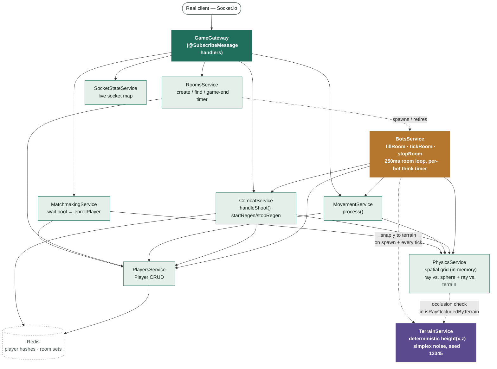

# Module Map — server-nest

Quick lookup for "which file do I open to fix X." Read this instead of grepping the whole
codebase. Keep it updated when you add/move functions — it goes stale fast otherwise.

---

## Diagram



Green = real client path through `GameGateway`. Amber = bot path — `BotsService` calls
`MovementService`/`CombatService` directly on its own per-room tick, no socket involved. Purple =
`TerrainService`, a pure deterministic height function ported 1:1 from the client's
`Ground.tsx` (same seed/noise formula) — bots snap to it (bots-only, not authoritative for real
players), and `PhysicsService` samples it to block shots that would pass through a hill. Both
main paths bottom out in `PlayersService`/`PhysicsService`/`Redis`.

*(Rendered version, if your viewer doesn't do inline Mermaid: https://claude.ai/code/artifact/71674ed5-5740-4bdf-a1cf-95a6ce689302)*

---

## Request flow (who calls who)

```
Client (socket.io)
  → GameGateway                     [src/game/gateway/game.gateway.ts]
      → SocketStateService          [connect/disconnect tracking]
      → MatchmakingService          [requestMatchmaking / cancelMatchmaking]
          → RoomsService            [room existence / creation]
          → PhysicsService          [spawn point]
          → PlayersService          [persist player to Redis]
      → MovementService             [updatePositionAndCamera]
          → PlayersService          [persist position]
          → PhysicsService          [grid cell update, nearby lookup]
      → CombatService               [shoot]
          → PhysicsService          [raycasting, nearby lookup]
          → PlayersService          [read room players]
          → RedisService            [atomic health/kill/death writes]

BotsService (no socket — driven by its own setInterval, not GameGateway)
  → started by GameGateway.handleRequestMatchmaking via BotsService.fillRoom
  → per tick, per bot: calls MovementService.process and (conditionally)
    CombatService.handleShoot — the exact same service methods a real
    client's socket events would call, just invoked directly instead of
    via a `@SubscribeMessage` handler
  → TerrainService.getHeight — bot y-position is snapped to terrain height
    on spawn and every tick (bots only; real players are not affected)
  → stopped by RoomsService.scheduleGameEnd's onExpiry callback

CombatService.handleShoot
  → PhysicsService.rayIntersectsSphere for hit-test, then
    PhysicsService.isRayOccludedByTerrain (→ TerrainService.getHeight,
    stepped every 2 units along the ray) to reject hits where a hill sits
    between shooter and target before damage is applied

Client (REST, axios)
  → GameController                  [src/game/game.controller.ts]
      → SocketStateService          [GET /game/onlinePlayers]
```

Everything ultimately bottoms out in `RedisService`, which is a thin typed wrapper around
`ioredis` — no game logic lives there.

---

## Module-by-module

### `GameGateway` — `src/game/gateway/game.gateway.ts`

**What it is:** The only place that talks socket.io directly. Every `@SubscribeMessage` here
is one client→server event from the legacy protocol table in `MIGRATION_GUIDE.md` §2.3.
**Do NOT put game logic here** — it should only: read the payload, call one service, emit the
result. If you're debugging "event X doesn't do the right thing," the *logic* bug is almost
always in the service it calls, not in this file.

| Function                                          | Socket event in                       | Events out                                                                                                                              | Calls                                                                                                                                                                |
| ------------------------------------------------- | ------------------------------------- | --------------------------------------------------------------------------------------------------------------------------------------- | -------------------------------------------------------------------------------------------------------------------------------------------------------------------- |
| `handleConnection`                              | connect                               | —                                                                                                                                      | `SocketStateService.add`. Assigns `guest-{id}` identity — **no real auth yet**.                                                                           |
| `handleDisconnect`                              | disconnect                            | `playerLeft`, `playerDisconnected`                                                                                                  | `SocketStateService.remove`, `PhysicsService.removeFromGrid`, `MatchmakingService.removeFromWaitPool`, `PlayersService.deletePlayer`                         |
| `handleRequestMatchmaking`                      | `requestMatchmaking`                | `searchingForMatch`, `spawnPoint`, `roomAssigned`, `roomSnapshot`, `playerJoined`, `waitingForPlayers`, `playerPoolCount` | `RoomsService.findAvailableRoom/createRoom/scheduleGameEnd`, `MatchmakingService.addToWaitPool/drainPool/enrollPlayer`, `PlayersService.getAllPlayersFromRoom` |
| `handleCancelMatchmaking`                       | `cancelMatchmaking`                 | `cancelledMatchmaking`                                                                                                                | `MatchmakingService.removeFromWaitPool`                                                                                                                            |
| `handleUpdatePositionAndCamera`                 | `updatePositionAndCamera`           | `playerMoved` (to nearby only)                                                                                                        | `MovementService.process`                                                                                                                                          |
| `handleShoot`                                   | `shoot`                             | (delegated)                                                                                                                             | `CombatService.handleShoot`                                                                                                                                        |
| `handlePlayerWalking` / `handlePlayerStopped` | `playerWalking` / `playerStopped` | same event, broadcast                                                                                                                   | none — pure relay                                                                                                                                                   |
| `handleSendMessage`                             | `sendMessage`                       | `receiveMessage`                                                                                                                      | none — pure relay                                                                                                                                                   |
| `joinSocketToRoom` (private helper)             | —                                    | `spawnPoint`, `roomAssigned`, `roomSnapshot`, `playerJoined`                                                                    | `MatchmakingService.enrollPlayer`, `PlayersService.getAllPlayersFromRoom`                                                                                        |

**Client payload gotcha:** `updatePositionAndCamera` expects ONE object
`{ position, velocity, cameraDirection, roomId }`, not multiple args like the legacy server used.

---

### `MatchmakingService` — `src/game/matchmaking/matchmaking.service.ts`

**What it is:** Owns the Redis wait-pool (`waitPool` SET) and turns a socket into a persisted
`Player`. Does **not** touch socket.io directly (no `io.emit` here) — the Gateway does emits.

| Function                                                      | Purpose                                                                                                                                                                                                                                                                                                                                              |
| ------------------------------------------------------------- | ---------------------------------------------------------------------------------------------------------------------------------------------------------------------------------------------------------------------------------------------------------------------------------------------------------------------------------------------------- |
| `addToWaitPool` / `removeFromWaitPool` / `getPoolCount` | Basic pool membership (Redis SET`waitPool`)                                                                                                                                                                                                                                                                                                        |
| `drainPool`                                                 | Atomically empties the pool via`SPOP` (reduces but doesn't eliminate BUG-12 race)                                                                                                                                                                                                                                                                  |
| `enrollPlayer`                                              | Gets a spawn point from`PhysicsService`, builds a `Player`, persists via `PlayersService.setPlayerInRoom`, **and registers the socket in the spatial grid** via `PhysicsService.updatePlayerCell` (fixed 2026-07-19 — previously missing, meant new players were invisible to movement/combat broadcasts until they personally moved) |

---

### `RoomsService` — `src/game/rooms/rooms.service.ts`

**What it is:** Room lifecycle only — create, list, find-available, remove, and the game timer.
Does not touch individual player data beyond counting them.

| Function              | Purpose                                                                                                                                                                                                                             |
| --------------------- | ----------------------------------------------------------------------------------------------------------------------------------------------------------------------------------------------------------------------------------- |
| `createRoom`        | New UUID, added to`rooms` SET                                                                                                                                                                                                     |
| `getAllRooms`       | Lists all rooms with player counts                                                                                                                                                                                                  |
| `findAvailableRoom` | Returns a room with`2 <= playerCount < MAX_PLAYERS`. **Note:** a room with exactly 1 player is never "available" — solo occupants can get stuck (see `MIGRATION_GUIDE.md` KU-05)                                         |
| `removeRoom`        | Deletes all`player:{roomId}:*` keys + `roomPlayers:{roomId}` + removes from `rooms` SET                                                                                                                                       |
| `scheduleGameEnd`   | `setTimeout` (default 60s) → cleans up room, then calls the `onExpiry` callback the Gateway passed in (which emits `gameOver`). **If the process crashes, this timer and the game state are lost** — known tech debt. |

Constants live in `rooms.constants.ts`: `MAX_PLAYERS = 20`, `MIN_PLAYERS_TO_START = 2`.

---

### `PlayersService` — `src/game/players/players.service.ts`

**What it is:** The only place that reads/writes individual player state in Redis. Pure data
layer — no matchmaking/combat/movement logic, just CRUD + (de)serialization.

| Function                  | Purpose                                                                                                                            |
| ------------------------- | ---------------------------------------------------------------------------------------------------------------------------------- |
| `setPlayerInRoom`       | Adds socketId to`roomPlayers:{roomId}` SET, writes full `Player` hash to `player:{roomId}:{socketId}`                        |
| `getPlayerFromRoom`     | Single player read + deserialize (returns`null` if missing)                                                                      |
| `updatePlayerInRoom`    | Partial hash update (used by movement)                                                                                             |
| `deletePlayer`          | Removes from room SET + deletes hash                                                                                               |
| `getAllPlayersFromRoom` | Batch read via Redis**pipeline** (all players in one round trip — this is better than the legacy server's sequential reads) |

`position`/`velocity`/`cameraDirection` are stored as JSON strings inside the hash; everything
else is a plain string field. If a player looks "corrupted" in Redis, check
`serializePlayer`/`deserializePlayer` first.

---

### `PhysicsService` — `src/game/physics/physics.service.ts`

**What it is:** Pure spatial math + the in-memory proximity grid. No Redis calls except reading
player positions (via `PlayersService`) to pick spawn points. **The grid lives in process
memory — it will NOT work if you ever run more than one server instance** (see
`MIGRATION_GUIDE.md` Decision A).

| Function                   | Purpose                                                                                                                                                                                                                                                                                                                                            |
| -------------------------- | -------------------------------------------------------------------------------------------------------------------------------------------------------------------------------------------------------------------------------------------------------------------------------------------------------------------------------------------------- |
| `getCellKey`             | `floor(x/100)_floor(z/100)` — 100-unit cells                                                                                                                                                                                                                                                                                                    |
| `updatePlayerCell`       | Moves a socket to its new cell, returns nearby socket IDs.**This is the function that determines who receives `playerMoved`/`playerShot` broadcasts** — if broadcasts aren't reaching someone, check whether they're actually in the grid (see `MatchmakingService.enrollPlayer` note above)                                          |
| `getNearbySocketIds`     | 3×3 cell lookup around a given cell key, excludes self                                                                                                                                                                                                                                                                                            |
| `removeFromGrid`         | Called on disconnect and on death                                                                                                                                                                                                                                                                                                                  |
| `getSpawnPosition`       | Random point, retried up to 50x to stay ≥70 units from existing room players (widened from 50/30 — at 50 a full room packed tightly enough that bots kept spawning next to each other and immediately fighting)                                                                                                                                  |
| `rayIntersectsSphere`    | Core hit-detection math used by`CombatService`                                                                                                                                                                                                                                                                                                   |
| `isRayOccludedByTerrain` | Walks the shot ray in`TERRAIN_SAMPLE_STEP` (2-unit) increments up to the hit distance, sampling `TerrainService.getHeight` at each point; `true` if the ray dips below ground anywhere along the way (a hill sits between shooter and target). Called from `CombatService.handleShoot` right after a sphere-hit, before damage is applied. |

---

### `TerrainService` — `src/game/terrain/terrain.service.ts`

**What it is:** A pure, stateless height function `getHeight(x, z) → number`, ported byte-for-byte
from the client's `Ground.tsx` (two-octave simplex noise, fixed `SEED = 12345`, same
frequencies/amplitudes). No rendering, no Three.js dependency — just `simplex-noise`'s
`createNoise2D`. Because both sides use the identical seed and formula, server and client terrain
agree everywhere with zero wire sync.

**Scope — bots only, not authoritative for real players.** Real player Y-position is still
whatever the client reports via `updatePositionAndCamera`; only bots (`BotsService.spawnBot` /
`tickBot`) snap their own `y` to `getHeight(x, z)`. Making terrain authoritative for real players
too would be a bigger change (server-side anti-cheat / physics authority) and was explicitly
scoped out for now.

| Function            | Purpose                                                                                                                          |
| ------------------- | -------------------------------------------------------------------------------------------------------------------------------- |
| `getHeight(x, z)` | Returns terrain height at that point; identical output to the client's`heightFunction` in `Ground.tsx` given the same inputs |

If bots ever look like they're floating or clipping through the ground, or if terrain occlusion
starts letting shots through hills, check this file *and* `Ground.tsx` are still byte-for-byte
in sync (seed, frequencies, amplitudes) before looking anywhere else.

---

### `MovementService` — `src/game/movement/movement.service.ts`

**What it is:** Thin coordinator, intentionally tiny. Exists so `PlayersService` doesn't need
socket.io access and `GameGateway` doesn't become a god object (see `MIGRATION_GUIDE.md` §5.3).

| Function    | Purpose                                                                                                                                                                           |
| ----------- | --------------------------------------------------------------------------------------------------------------------------------------------------------------------------------- |
| `process` | Persists new transform (`PlayersService.updatePlayerInRoom`) → updates grid cell (`PhysicsService.updatePlayerCell`) → returns nearby socket IDs for the Gateway to emit to |

If movement isn't broadcasting, the bug is in `PhysicsService`'s grid, not here.

**Dash ability** (`activateDash`, triggered by client `dash` event, key `E`): an
engage-focused gap-closer, not a free-aim blink — direction auto-locks onto the nearest
other player within 40 units (falls back to current facing if no one's close), moves the
player 10 units in that direction, and clamps the landing `y` to `TerrainService.getHeight`
so it can't dash through/over a hill (it can still cross through 3D obstacles like trees,
since those are client-only geometry the server has no model of — a known limitation).
Uses a banked-charge system (`dashCharges`/`lastDashChargeAt` on `Player`, max 5, +1 every
2s) rather than a single cooldown, resolved lazily from elapsed time — no per-room interval
ticking the network. Emits `dashActivated` to the whole room (position + updated charge
state) on success so opponents hard-snap instead of dead-reckoning through the gap, or
`dashOnCooldown` to the caller only if no charges are banked.

---

### `CombatService` — `src/game/combat/combat.service.ts`

**What it is:** Shoot → hit-detection → damage → death → respawn, all in one place. Also owns
passive health regen for real players (`startRegen`/`stopRegen`/`tickRegen`) — a separate
per-room `setInterval`, same lifecycle shape as `BotsService.roomIntervals` — and the
invincibility ability (`activateInvincibility`), a press-to-use 5s damage-immunity window on a
10s cooldown, both enforced server-side against `Player.invincibleUntil`/`abilityCooldownUntil`.

| Function                                               | Purpose                                                                                                                                                                                                                                                                                                                                                                                                                                                                                                                                                                                                                                                                                                                                                                                                                        |
| ------------------------------------------------------ | ------------------------------------------------------------------------------------------------------------------------------------------------------------------------------------------------------------------------------------------------------------------------------------------------------------------------------------------------------------------------------------------------------------------------------------------------------------------------------------------------------------------------------------------------------------------------------------------------------------------------------------------------------------------------------------------------------------------------------------------------------------------------------------------------------------------------------ |
| `handleShoot`                                        | Emits`playerShot` once to nearby players (fixed: legacy bug emitted per-player-in-loop), then raycasts against every player in the room, applies `-10` health via `hIncrBy`, stamps `lastHitAt` (resets the regen clock — see below), calls `tryKill` if health ≤ 0                                                                                                                                                                                                                                                                                                                                                                                                                                                                                                                                                |
| `tryKill` (private)                                  | Redis`WATCH`/`MULTI` optimistic-lock loop (3 retries) so two simultaneous killing blows can't double-count a kill. Winner emits `youDied` + `playerDead`, removes victim from grid, schedules respawn                                                                                                                                                                                                                                                                                                                                                                                                                                                                                                                                                                                                                  |
| `scheduleRespawn` (private)                          | `setTimeout(5000)` → new spawn point, resets health/isDead/`lastHitAt`, emits `spawnPoint` + `playerRespawned`                                                                                                                                                                                                                                                                                                                                                                                                                                                                                                                                                                                                                                                                                                        |
| `startRegen(roomId, server)` / `stopRegen(roomId)` | Starts/stops a per-room`setInterval` (`REGEN_TICK_MS` = 100ms) that heals real players (`isBot` excluded) by `REGEN_AMOUNT` = 1/tick (10hp/sec), capped at 100, once `REGEN_IDLE_MS` = 10s have passed since `lastHitAt` with no further hits — reads as a smooth climb rather than a delayed chunky jump. Emits `healthRegen` to the player's own socket only (targeted, not a room broadcast). Lifecycle mirrors `BotsService.roomIntervals` — started in `GameGateway.handleRequestMatchmaking` alongside `botsService.fillRoom`, stopped in `RoomsService.scheduleGameEnd`'s `onExpiry` callback alongside `botsService.stopRoom` |
| `activateInvincibility(roomId, playerId, server)` | Player-triggered ability (client presses `Q`, emits `useAbility`). Rejects with `abilityOnCooldown` (targeted emit, includes `remainingMs`) if `now < abilityCooldownUntil`; otherwise sets `invincibleUntil = now + 5000` and `abilityCooldownUntil = now + 10000` on the player's Redis hash and broadcasts `abilityActivated` to the whole room (so other clients can render the shield glow on that player, not just the caller). `handleShoot` checks `now < target.invincibleUntil` per-hit — damage is skipped and `hitBlocked` is emitted instead of `hit`, so the shot visibly "connects" without doing anything rather than silently vanishing. |

Shooter is excluded from self-damage by comparing **socket IDs** (fixed vs. legacy's
socketId-vs-userId mismatch bug).

**Shooter argument is now a plain `ShooterIdentity` (`{ id, username }`)**, not a live
`AuthenticatedSocket` — changed so `BotsService` can call `handleShoot` without a real socket.
Victims never needed a live socket (they're read straight from `PlayersService`), so this was a
one-sided refactor; only the shooter side changed.

---

### `BotsService` — `src/game/bots/bots.service.ts`

**What it is:** Fills a room up to a target headcount (default 10, `BOT_FILL_TARGET`) with bot
`Player` Redis records and drives them through a per-room `setInterval` tick. A bot is just a
`Player{ isBot: true }` with **no socket and no `SocketStateService` entry** — this works because
`PlayersService`/`CombatService` never assumed a live socket was required for player state to
exist.

| Function                                              | Purpose                                                                                                                                                                                                                                                                                                                                                                                                                                                                                                                                                                                                                                                                                                                                                                                                                                                                                                                                                                                                                                                                                                                                                                                                                                                             |
| ----------------------------------------------------- | ------------------------------------------------------------------------------------------------------------------------------------------------------------------------------------------------------------------------------------------------------------------------------------------------------------------------------------------------------------------------------------------------------------------------------------------------------------------------------------------------------------------------------------------------------------------------------------------------------------------------------------------------------------------------------------------------------------------------------------------------------------------------------------------------------------------------------------------------------------------------------------------------------------------------------------------------------------------------------------------------------------------------------------------------------------------------------------------------------------------------------------------------------------------------------------------------------------------------------------------------------------------- |
| `fillRoom(roomId, targetCount, server)`             | Reads current room headcount, spawns`targetCount - current` bots, starts the room's tick interval if any were spawned                                                                                                                                                                                                                                                                                                                                                                                                                                                                                                                                                                                                                                                                                                                                                                                                                                                                                                                                                                                                                                                                                                                                             |
| `spawnBot` (private)                                | Builds a`Player{isBot:true}`, persists via `PlayersService.setPlayerInRoom`, registers it in `PhysicsService`'s grid, seeds a per-bot `BotState` (traits below) into `botStates`, emits `playerJoined`                                                                                                                                                                                                                                                                                                                                                                                                                                                                                                                                                                                                                                                                                                                                                                                                                                                                                                                                                                                                                                                  |
| `stopRoom(roomId)`                                  | Clears that room's tick interval — called from`RoomsService.scheduleGameEnd`'s `onExpiry`                                                                                                                                                                                                                                                                                                                                                                                                                                                                                                                                                                                                                                                                                                                                                                                                                                                                                                                                                                                                                                                                                                                                                                      |
| `tickRoom` (private, every `BOT_TICK_MS` = 250ms) | Reads all players+bots in the room, computes the cluster centroid, calls`tickBot` for each live bot — but each bot only actually re-decides on its own jittered cadence (see below), so this fine-grained loop does not mean bots all move in lockstep                                                                                                                                                                                                                                                                                                                                                                                                                                                                                                                                                                                                                                                                                                                                                                                                                                                                                                                                                                                                           |
| `computeClusterCentroid` (private)                  | Density-bucketed (`BOT_CLUSTER_CELL_SIZE` = 20-unit cells) — picks the most populated bucket and averages its positions. **Recomputed fresh every tick** (bots can flip targets as clusters shift — intentional, not a bug)                                                                                                                                                                                                                                                                                                                                                                                                                                                                                                                                                                                                                                                                                                                                                                                                                                                                                                                                                                                                                               |
| `tickBot` (private)                                 | Gated by a per-bot`nextThinkAt` timestamp (`BOT_THINK_INTERVAL_MIN_MS`–`MAX_MS` = 700–1300ms, randomized per bot) — this is what stops every bot from moving/retargeting/firing on the same beat. When it thinks: picks a target within its own `engagementRadius` (25–35, randomized per bot), **prefers a real player over another bot**, and skips real-player targets already locked by `BOT_MAX_ENGAGERS_PER_TARGET` (2) other bots so a human doesn't get swarmed by the whole room; sticky-locks the target (`botTargets`) but drops the lock early if it's a bot and a real player has since come into range. While a target is locked, rolls `BOT_INVINCIBILITY_USE_CHANCE` (15%) and `BOT_DASH_USE_CHANCE` (20%, only if the target is at least `BOT_DASH_MIN_TARGET_DISTANCE` = 15 units away) each think to pop the same abilities real players get — bots share the exact server-side charge/cooldown state, this is purely an AI decision layer on top. The dash call is `await`ed (unlike invincibility, fire-and-forget) because it overwrites the bot's position and the chase-movement right after it would otherwise read the pre-dash snapshot and silently undo it. Applies a small random aim-error cone (`BOT_AIM_ERROR_MAX_RAD`) before firing, waits a per-bot `reactionDelayMs` (200–600ms) after first acquiring a target, then fires no faster than a per-bot `fireCooldownMs` (500–900ms) — via `CombatService.handleShoot`. Idle (no target) bots roam toward the cluster centroid plus their own persistent `roamOffset` (±`BOT_ROAM_OFFSET_RADIUS` = 8 units) instead of all stacking on the exact same point. Movement still goes through `MovementService.process` (same path real movement uses), snapping `y` to `TerrainService.getHeight` afterward. |

**Design invariant:** bots never hold a socket, and `MovementService`/`CombatService` broadcasts
already target only nearby *socket* IDs (via `PhysicsService`'s grid) — so bot presence costs
server-side compute (Redis calls, grid updates) but **zero extra outbound bandwidth** beyond what
a real nearby player would already receive. Bandwidth still scales with real player count only.

Constants live in `bots.constants.ts`: `BOT_FILL_TARGET = 10`, `BOT_TICK_MS = 250`,
`BOT_THINK_INTERVAL_MIN_MS`/`MAX_MS` = 700/1300, `BOT_MOVE_SPEED_MIN`/`MAX` = 3/5,
`BOT_ENGAGEMENT_RADIUS_MIN`/`MAX` = 25/35, `BOT_HOLD_DISTANCE_MIN`/`MAX` = 12/18,
`BOT_REACTION_DELAY_MIN_MS`/`MAX_MS` = 200/600, `BOT_FIRE_COOLDOWN_MIN_MS`/`MAX_MS` = 500/900,
`BOT_AIM_ERROR_MAX_RAD` = 0.05, `BOT_ROAM_OFFSET_RADIUS` = 8, `BOT_MAX_ENGAGERS_PER_TARGET` = 2,
`BOT_CLUSTER_CELL_SIZE = 20`.

**Why the per-bot randomization exists:** the original implementation drove every bot off one
shared per-room tick with identical speed/range/aim and no reaction delay, so bots visibly moved,
retargeted, and fired in lockstep and swarmed a single real player with every bot in the room —
an easy tell that they weren't real players. `BotState` (per-bot traits + independent think
timer) and the real-player-priority/engager-cap targeting logic exist specifically to break both
patterns.

**Known gap:** bots are not despawned as real players fill a room past what's needed — they
occupy slots for the room's full lifetime once spawned. If live players should displace bots,
that logic doesn't exist yet.

---

### `RedisService` — `src/game/redis/redis.service.ts`

Thin camelCase wrapper around `ioredis`. No business logic — if you need a new Redis command,
add a one-line passthrough method here rather than injecting raw `ioredis` elsewhere.

### `SocketStateService` — `src/game/socket-state/socket-state.service.ts`

In-memory `Map<socketId, Socket>` for "who's currently connected." This is intentionally
**not** in Redis (see `MIGRATION_GUIDE.md` §5.2 — the legacy Redis list for this was broken and
was not ported). Backs `GET /game/onlinePlayers`.

### `GameController` — `src/game/game.controller.ts`

REST endpoint(s). Currently just `GET /game/onlinePlayers` → `{ players: number }`. This is the
first REST controller in the NestJS server — everything else the client needs (auth, room list,
etc.) still doesn't exist yet.

### `GameService` — `src/game/game.service.ts`

**Not gameplay logic.** This is a startup self-test that runs once via `OnModuleInit` and
prints PASS/FAIL diagnostics to the console for Rooms/Players/Matchmaking services. Its
hardcoded "Not yet implemented" list at the bottom is **stale** — Physics/Movement/Combat are
all implemented; nobody updated this list after building them. Don't trust that list; trust this
document (and the code) instead. Safe to delete before shipping to prod.

### `GameLoggerService` — `src/common/logger/game-logger.service.ts`

Thin wrapper around Nest's built-in `Logger`. Currently **not injected anywhere** — dead code,
or intended for future use. Most services just use `console.log`/`console.error` directly right now.

### `PrismaModule` / `PrismaService` — `src/prisma/`

Empty stub. Nothing in the gameplay path uses this yet (intentionally deferred — accounts/stats
persistence is a later phase).

---

## Redis keys, at a glance

| Key                            | Type            | Written by                                                                                                                                                                                 | Read by                                                                                                                                |
| ------------------------------ | --------------- | ------------------------------------------------------------------------------------------------------------------------------------------------------------------------------------------ | -------------------------------------------------------------------------------------------------------------------------------------- |
| `rooms`                      | SET of roomId   | `RoomsService.createRoom`                                                                                                                                                                | `RoomsService.getAllRooms/findAvailableRoom`, `RoomsService.removeRoom`                                                            |
| `roomPlayers:{roomId}`       | SET of socketId | `PlayersService.setPlayerInRoom/deletePlayer`                                                                                                                                            | `RoomsService` (for counts), `PlayersService.getAllPlayersFromRoom`                                                                |
| `player:{roomId}:{socketId}` | HASH            | `PlayersService.setPlayerInRoom/updatePlayerInRoom`, `CombatService` (health/kills/deaths/isDead/position on respawn, `lastHitAt` on every hit and on respawn, health on regen tick, `invincibleUntil`/`abilityCooldownUntil` on ability use) | `PlayersService.getPlayerFromRoom/getAllPlayersFromRoom`, `CombatService` (`tickRegen` reads `lastHitAt`/`health`/`isBot`; `handleShoot` reads `invincibleUntil` before applying damage) |
| `player:{roomId}:{botId}`    | HASH            | Same as above — bots are ordinary`Player` hashes (`isBot: 'true'`, `socketId` = `bot-<uuid>`, never a real socket ID) written by `BotsService.spawnBot`                         | Same readers as real players — nothing filters bots out                                                                               |
| `waitPool`                   | SET of socketId | `MatchmakingService.addToWaitPool/removeFromWaitPool/drainPool`                                                                                                                          | `MatchmakingService.getPoolCount`                                                                                                    |

Same key names as the legacy server (`MIGRATION_GUIDE.md` §7 flags this as required for a safe
transition) — do not rename without checking both codebases if they ever share a Redis instance.

---

## Fast debugging checklist

- **"Players can't find a match"** → `MatchmakingService` + `RoomsService.findAvailableRoom`
  (remember: rooms need ≥2 players to be "available," a lone player can't be joined).
- **"I don't see other players move"** → `PhysicsService` grid. Check the player was actually
  inserted into a cell (`updatePlayerCell`) — enrollment does this now, but if you add another
  entry point for spawning a player, it needs to call this too or they'll be invisible to nearby
  lookups.
- **"Shots don't register"** → `CombatService.handleShoot`, specifically `rayIntersectsSphere`
  inputs — log `rayOrigin`/`rayDirection`/`playerCenter` before assuming the math is wrong. If
  the sphere-hit passes but the player still isn't taking damage, check
  `PhysicsService.isRayOccludedByTerrain` next — a hit is intentionally dropped if a hill sits
  between shooter and target.
- **"Bots are floating above / clipping into the ground"** → `TerrainService.getHeight` vs.
  `Ground.tsx`'s `heightFunction` have drifted out of sync (seed, frequencies, or amplitudes no
  longer match). This only affects bots — real player `y` is client-authoritative and untouched.
- **"CORS error in browser console"** → two separate CORS configs exist: `main.ts`
  (`app.enableCors`, for REST) and `game.gateway.ts` (`@WebSocketGateway({ cors: ... })`, for
  socket.io). They must both include `credentials: true` and an explicit origin — never `'*'`
  together with credentials.
- **"404 on some /game/... route"** → check `GameController`; most REST endpoints the client
  expects (see `client/app/page.tsx` and friends) don't exist yet.
- **"Everyone is a guest"** → expected right now. Auth (`BUG-01` in `MIGRATION_GUIDE.md`) and
  Prisma are deliberately deferred until gameplay works end-to-end.
- **"Bots aren't moving/shooting"** → check `BotsService.roomIntervals` actually has an entry for
  that room (only set if `fillRoom` spawned ≥1 bot); if the interval exists but bots are idle,
  log `computeClusterCentroid`'s output — an empty/self-only room will barely move them since the
  centroid collapses to their own position.
- **"Bots are shooting through walls / never miss"** → same `rayIntersectsSphere` path real shots
  use — this is a pre-existing physics gap, not bot-specific.
- **"Player's health isn't regenerating"** → check `CombatService.regenIntervals` has an entry for
  that room (only set if `startRegen` was called — wired in `GameGateway.handleRequestMatchmaking`
  right after `botsService.fillRoom`); then check `lastHitAt` on the player's Redis hash — any hit
  resets it, so regen only kicks in `REGEN_IDLE_MS` (10s) after the *last* hit, not 10s after
  spawn. Bots never regen (`tickRegen` skips `isBot` players) — that's intentional, not a bug.
