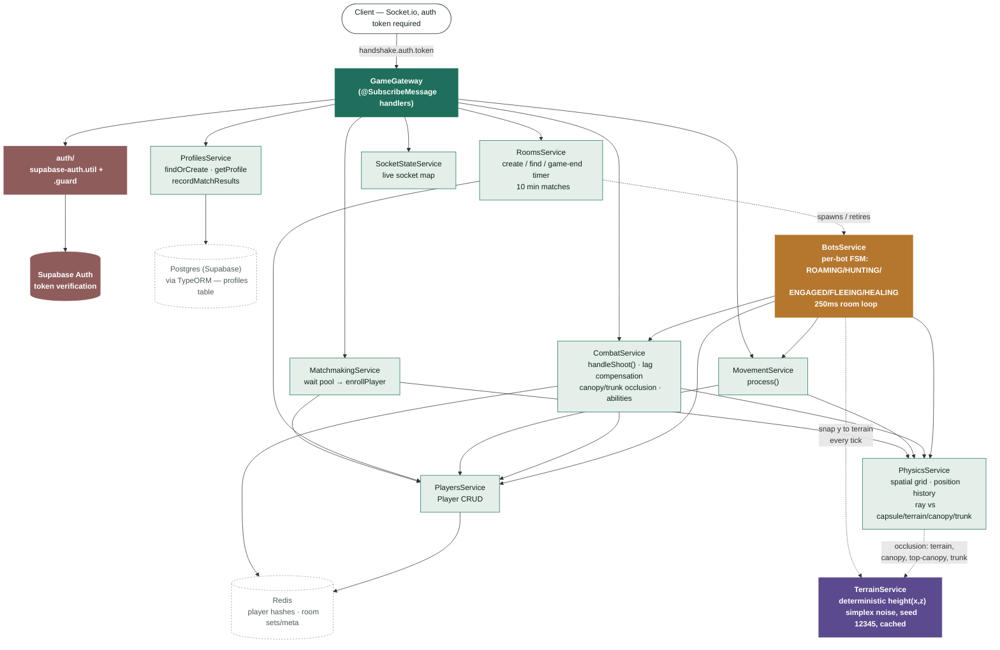

# Module Map — server-nest

Quick lookup for "which file do I open to fix X." Read this instead of grepping the whole
codebase. Keep it updated when you add/move functions — it goes stale fast otherwise (the
previous version of this doc predated auth, profiles, Postgres, canopy/trunk occlusion, lag
compensation, and the bot FSM rewrite — all of that is real and shipped, not hypothetical).

---

## Diagram



Green = real client path through `GameGateway`. Amber = bot path — `BotsService` drives bots
through the same `MovementService`/`CombatService` calls a real client's socket events would
trigger, just invoked directly on its own per-room tick. Red = auth/identity — every socket
connection is now a hard reject without a valid Supabase token; there is no more guest fallback.
Purple = `TerrainService`. Both main paths bottom out in `PlayersService`/`PhysicsService`/`Redis`;
match results additionally flow into Postgres via `ProfilesService` when a room's timer expires.

---

## Request flow (who calls who)

```
Client connects (socket.io, `io(url, { auth: { token } })`)
  → GameGateway.handleConnection      [src/game/gateway/game.gateway.ts]
      → verifySupabaseToken           [src/auth/supabase-auth.util.ts] — hard reject if missing/invalid
      → ProfilesService.findOrCreate  [src/profiles/profiles.service.ts] — first-ever-connection row
      → SocketStateService.add

Client (socket.io game events)
  → GameGateway
      → MatchmakingService            [requestMatchmaking / cancelMatchmaking]
          → RoomsService              [room existence / creation / 10-min game timer]
          → PhysicsService            [spawn point, obstacle-safe]
          → PlayersService            [persist player to Redis]
          → BotsService.fillRoom      [trickles bots in on a room create]
          → CombatService.startRegen  [per-room regen loop starts alongside bots]
      → MovementService                [updatePositionAndCamera]
          → PlayersService            [persist position]
          → PhysicsService            [grid cell update, nearby lookup, position history sample]
      → CombatService                 [shoot / useAbility]
          → PhysicsService            [lag-compensated raycast vs vertical capsule,
                                        terrain/canopy/top-canopy/trunk occlusion]
          → PlayersService            [read room players]
          → RedisService               [atomic health/kill/death writes]

RoomsService.scheduleGameEnd (10 min after room creation)
  → reads final roomPlayers, filters out bots
  → BotsService.stopRoom + CombatService.stopRegen
  → emits `gameOver` to the room
  → ProfilesService.recordMatchResults  [durable K/D/matches stat bump, Postgres]
  → RoomsService.removeRoom              [wipes Redis room state]

BotsService (no socket — driven by its own setInterval, not GameGateway)
  → started by GameGateway.handleRequestMatchmaking via BotsService.fillRoom
  → per tick, per bot: runs a 5-state FSM (ROAMING/HUNTING/ENGAGED/FLEEING/HEALING),
    calling the exact same MovementService.process / CombatService.handleShoot a real
    client's socket events would call
  → TerrainService.getHeight — bot y-position snapped to terrain every tick
  → stopped by RoomsService.scheduleGameEnd's onExpiry callback, or self-destructs
    (BotsService.destroyRoom) once no real player remains

CombatService.handleShoot
  → PhysicsService.getPositionAt (lag compensation: rewinds a real shooter's target
    to where they were ~500ms ago, from a rolling per-socket position history)
  → PhysicsService.rayIntersectsVerticalCapsule (hit-test — a vertical capsule, not a
    sphere, so horizontal aim stays PLAYER_RADIUS-accurate while vertical aim is forgiving)
  → PhysicsService.isPathOccluded (terrain, tree canopy ellipsoids, top-canopy crown,
    and trunk cylinders — all real cover now, not terrain-only)

Client (REST, axios)
  → GameController                  [GET /game/onlinePlayers]
  → ProfilesController              [GET /profiles/me, GET /profiles/:userId,
                                      PATCH /profiles/me — all behind SupabaseAuthGuard]
```

Everything game-state ultimately bottoms out in `RedisService` (ephemeral, per-match). Durable
player identity/stats bottom out in `ProfilesService` → TypeORM → Postgres (Supabase-hosted).

---

## Module-by-module

### `GameGateway` — `src/game/gateway/game.gateway.ts`

**What it is:** The only place that talks socket.io directly. Every `@SubscribeMessage` here is
one client→server event. **Do NOT put game logic here** — it should only: read the payload, call
one service, emit the result. If an event doesn't do the right thing, the *logic* bug is almost
always in the service it calls, not this file.

| Function                                          | Socket event in                       | Events out                                                                                                                              | Calls                                                                                                                                                                |
| ------------------------------------------------- | -------------------------------------- | ------------------------------------------------------------------------------------------------------------------------------------- | ---------------------------------------------------------------------------------------------------------------------------------------------------------------------- |
| `afterInit`                                      | —                                       | —                                                                                                                                        | `reconcileGhostPlayers` — sweeps Redis player/room state left over from a previous process's crash/restart before accepting new connections |
| `handleConnection`                              | connect                               | (disconnects the socket on failure)                                                                                                     | `verifySupabaseToken`. **Hard reject** if `handshake.auth.token` is missing/invalid/expired — no guest fallback anymore. On success: `ProfilesService.findOrCreate`, `SocketStateService.add` |
| `handleDisconnect`                              | disconnect                            | `playerLeft`, `playerDisconnected`                                                                                                  | `SocketStateService.remove`, `PhysicsService.removeFromGrid`, `MatchmakingService.removeFromWaitPool`, `PlayersService.deletePlayer`, `reapIfNoRealPlayersLeft`         |
| `handleRequestMatchmaking`                      | `requestMatchmaking`                | `searchingForMatch`, `spawnPoint`, `roomAssigned`, `roomSnapshot`, `playerJoined`, `waitingForPlayers`, `playerPoolCount`, `gameStarted` | `RoomsService.findAvailableRoom/createRoom/scheduleGameEnd/setRoomStart`, `MatchmakingService.addToWaitPool/drainPool`, `BotsService.fillRoom`, `CombatService.startRegen` |
| `handleCancelMatchmaking`                       | `cancelMatchmaking`                 | `cancelledMatchmaking`                                                                                                                | `MatchmakingService.removeFromWaitPool`                                                                                                                            |
| `handleUpdatePositionAndCamera`                 | `updatePositionAndCamera`           | `playerMoved` (to nearby only)                                                                                                        | `MovementService.process`                                                                                                                                          |
| `handleShoot`                                   | `shoot`                             | (delegated)                                                                                                                             | `CombatService.handleShoot`                                                                                                                                        |
| `handleUseAbility`                              | `useAbility`                        | (delegated)                                                                                                                             | `CombatService.activateInvincibility`                                                                                                                              |
| `handlePlayerWalking` / `handlePlayerStopped` | `playerWalking` / `playerStopped` | same event, broadcast                                                                                                                   | none — pure relay                                                                                                                                                   |
| `handleSendMessage`                             | `sendMessage`                       | `receiveMessage`                                                                                                                      | none — pure relay                                                                                                                                                   |
| `handleDebugConnections` / `handlePing`       | `debug:connections` / `ping-check` | same, targeted                                                                                                                          | `SocketStateService.count`                                                                                                                                          |
| `joinSocketToRoom` (private helper)             | —                                    | `spawnPoint`, `roomAssigned`, `gameStarted` (if room already running), `roomSnapshot`, `playerJoined`                             | `MatchmakingService.enrollPlayer`, `RoomsService.getRoomStart`, `PlayersService.getAllPlayersFromRoom`                                                              |

**Auth is now mandatory, not optional.** Client must connect with
`io(url, { auth: { token: supabaseAccessToken } })`. A missing/invalid/expired token gets a hard
`socket.disconnect(true)` — there is no more `guest-{id}` identity. `socket.userId` is the
Supabase `sub` claim (durable across sessions); `socket.username` comes from
`usernameFromClaims` (metadata username → email prefix → `player-{id prefix}` fallback).

**Match duration is 10 minutes** (`gameDurationMs = 10 * 60_000`), not the 60s in earlier builds.
`gameStarted { startTime, duration }` is broadcast on room creation and re-sent to anyone who
joins an already-running room mid-match (via `RoomsService.getRoomStart`), so a late joiner's
client can still render an accurate countdown.

**Client payload gotcha:** `updatePositionAndCamera` expects ONE object
`{ position, velocity, cameraDirection, roomId }`, not multiple args.

---

### `auth/` — `src/auth/supabase-auth.util.ts`, `src/auth/supabase-auth.guard.ts`

**What it is:** All Supabase identity verification lives here — nothing else in the codebase
calls Supabase directly.

- `verifySupabaseToken(token)` — calls `supabase.auth.getUser(token)` (a live network round-trip
  to Supabase, **not** local JWT verification). This project is on Supabase's newer "JWT Signing
  Keys" model, so a shared HS256 secret can't verify tokens locally anymore — `SUPABASE_JWT_SECRET`
  in `docker-compose.yml`/`.env` is legacy/vestigial at this point. The network call is fine here
  because it only runs once per socket connect, never per game event.
- `usernameFromClaims(claims)` — `user_metadata.username` → email prefix → `player-{sub prefix}`.
- `SupabaseAuthGuard` (`CanActivate`) — REST-side guard, used by `ProfilesController`. Reads
  `Authorization: Bearer <token>`, calls the same `verifySupabaseToken`, and stamps
  `request.userId` for the controller to read. Socket auth (`GameGateway.handleConnection`) does
  **not** use this guard — it calls `verifySupabaseToken` directly, since Nest guards don't apply
  to `handleConnection`.

---

### `database/database.module.ts`

**What it is:** `TypeOrmModule.forRoot(...)`, pointed at `DATABASE_URL` (Supabase's pooled
Postgres connection string). SSL is forced on (`rejectUnauthorized: false`) since Supabase
requires it and `pg` doesn't default to it. `synchronize` is on outside production — TypeORM
auto-migrates the schema from entity decorators, no manual migration files yet.

**There is now a real Postgres/TypeORM layer** — the previous version of this doc said "no
Postgres, no Prisma, no ORM anywhere in this repo." That's no longer true; it's TypeORM, not
Prisma, and it's wired into `AppModule` already.

---

### `profiles/` — `profile.entity.ts`, `profiles.service.ts`, `profiles.controller.ts`, `profiles.module.ts`

**What it is:** Durable player identity/stats, separate lifecycle from the per-match Redis player
hashes. One row per Supabase Auth user (`Profile.id` = the Supabase `sub`), created lazily on
first-ever connection (`ProfilesService.findOrCreate`, called from
`GameGateway.handleConnection`) — no separate signup flow needed.

| Function                    | Purpose                                                                                                                                                     |
| ---------------------------- | -------------------------------------------------------------------------------------------------------------------------------------------------------- |
| `findOrCreate`             | Get-or-insert a profile row for a Supabase user id                                                                                                          |
| `getProfile`               | Returns a `PublicProfile` (adds a computed `kdRatio` — deliberately **not** a stored column, so it can never drift from the raw counters)                |
| `updateUsername`           | Patch a user's own username                                                                                                                                 |
| `recordMatchResults`       | Bumps `totalKills`/`totalDeaths`/`matchesPlayed` for every real (non-bot) player in a room, called from `RoomsService.scheduleGameEnd`'s expiry callback |

REST surface (`ProfilesController`, all behind `SupabaseAuthGuard`):

| Route                    | Purpose                                                                                     |
| ------------------------- | -------------------------------------------------------------------------------------------- |
| `GET /profiles/me`      | Caller's own profile — id comes from the verified token, never the URL                     |
| `GET /profiles/:userId` | Any player's public profile (for viewing others' rank/stats)                                |
| `PATCH /profiles/me`    | Update own username                                                                          |

`rank` exists as a column on `Profile` but nothing currently computes/writes it — it's always
whatever `synchronize`'s default (`0`) leaves it at until a ranking job is built.

---

### `MatchmakingService` — `src/game/matchmaking/matchmaking.service.ts`

**What it is:** Owns the Redis wait-pool (`waitPool` SET) and turns a socket into a persisted
`Player`. Does **not** touch socket.io directly — the Gateway does emits.

| Function                                                      | Purpose                                                                                                                                                                                                                                                                                                                                              |
| ---------------------------------------------------------------- | ----------------------------------------------------------------------------------------------------------------------------------------------------------------------------------------------------------------------------------------------------------------------------------------------------------------------------------------------------- |
| `addToWaitPool` / `removeFromWaitPool` / `getPoolCount` | Basic pool membership (Redis SET `waitPool`)                                                                                                                                                                                                                                                                                                        |
| `drainPool`                                                 | Atomically empties the pool via `SPOP`                                                                                                                                                                                                                                                                                                              |
| `enrollPlayer`                                              | Gets a spawn point from `PhysicsService`, builds a `Player`, persists via `PlayersService.setPlayerInRoom`, **and registers the socket in the spatial grid** via `PhysicsService.updatePlayerCell` |

**Ghost/reap sweeps (not in the diagram above):** `GameGateway.afterInit` runs
`reconcileGhostPlayers` once at boot — Redis player/room state has no TTL and outlives a process
restart, but live Socket.IO connections don't, so anything left over from before boot is deleted.
`GameGateway.handleDisconnect` calls `reapIfNoRealPlayersLeft` after a real player leaves — if the
room now has bots only, it tears the room down (`BotsService.destroyRoom` + `RoomsService.removeRoom`)
rather than paying tick/network cost for bots fighting nobody. `BotsService.tickRoom` has the same
check as a third backstop for paths neither of the above can see.

---

### `RoomsService` — `src/game/rooms/rooms.service.ts`

**What it is:** Room lifecycle — create, list, find-available, remove, and the game timer/meta.

| Function                          | Purpose                                                                                                                                                                                                                                     |
| ---------------------------------- | ---------------------------------------------------------------------------------------------------------------------------------------------------------------------------------------------------------------------------------------------- |
| `createRoom`                     | New UUID, added to `rooms` SET                                                                                                                                                                                                             |
| `getAllRooms`                    | Lists all rooms with player counts                                                                                                                                                                                                          |
| `findAvailableRoom`              | Returns a room with `playerCount < MAX_PLAYERS` (20). `MIN_PLAYERS_TO_START` is now **1** — a solo player can start a match on their own (bots fill the rest); this is a change from the old ≥2 requirement.                          |
| `removeRoom`                     | Deletes all `player:{roomId}:*` keys + `roomPlayers:{roomId}` + `roomMeta:{roomId}` + removes from `rooms` SET                                                                                                                        |
| `setRoomStart` / `getRoomStart` | Persists/reads `{ startTime, duration }` into `roomMeta:{roomId}` — lets a client that joins mid-match (or reconnects) render an accurate countdown instead of assuming the match just started                                        |
| `scheduleGameEnd`                | `setTimeout` (default 10 min) → calls the caller's `onExpiry` callback **first** (while player data is still in Redis, so stats/results can be read), **then** wipes the room's Redis state via `removeRoom`                       |

Constants live in `rooms.constants.ts`: `MAX_PLAYERS = 20`, `MIN_PLAYERS_TO_START = 1`.

---

### `PlayersService` — `src/game/players/players.service.ts`

**What it is:** The only place that reads/writes individual player state in Redis. Pure data
layer — no matchmaking/combat/movement logic, just CRUD + (de)serialization.

| Function                  | Purpose                                                                                                                            |
| --------------------------- | ------------------------------------------------------------------------------------------------------------------------------------ |
| `setPlayerInRoom`       | Adds socketId to `roomPlayers:{roomId}` SET, writes full `Player` hash to `player:{roomId}:{socketId}`                        |
| `getPlayerFromRoom`     | Single player read + deserialize (returns `null` if missing)                                                                      |
| `updatePlayerInRoom`    | Partial hash update (used by movement/regen/heal)                                                                                    |
| `deletePlayer`          | Removes from room SET + deletes hash                                                                                               |
| `getAllPlayersFromRoom` | Batch read via Redis **pipeline** (all players in one round trip)                                                                 |

`position`/`velocity`/`cameraDirection` are stored as JSON strings inside the hash; everything
else is a plain string field. Deserialization defaults missing `lastHitAt`/`invincibleUntil`/
`abilityCooldownUntil` for players persisted before those fields existed, so old Redis data
doesn't crash the server on read. If a player looks "corrupted" in Redis, check
`serializePlayer`/`deserializePlayer` first.

---

### `PhysicsService` — `src/game/physics/physics.service.ts`

**What it is:** Pure spatial math, the in-memory proximity grid, per-socket position history (for
lag compensation), and world-geometry occlusion (terrain + tree canopy + tree trunk). No Redis
calls except reading player positions (via `PlayersService`) to pick spawn points. **The grid and
position history live in process memory — none of this works if you ever run more than one
server instance.**

| Function                       | Purpose                                                                                                                                                                                                                                                                                                                                            |
| -------------------------------- | -------------------------------------------------------------------------------------------------------------------------------------------------------------------------------------------------------------------------------------------------------------------------------------------------------------------------------------------------- |
| `getCellKey`                   | `floor(x/100)_floor(z/100)` — 100-unit cells                                                                                                                                                                                                                                                                                                    |
| `updatePlayerCell`             | Moves a socket to its new cell, returns nearby socket IDs. **This determines who receives `playerMoved`/`playerShot` broadcasts** — if broadcasts aren't reaching someone, check they're actually in the grid                                                                                                                              |
| `getNearbySocketIds`           | 3×3 cell lookup around a given cell key, excludes self                                                                                                                                                                                                                                                                                            |
| `removeFromGrid`               | Called on disconnect and on death; also clears that socket's position history                                                                                                                                                                                                                                                                     |
| `getSpawnPosition`             | Random point, retried up to 50x to stay ≥70 units from existing room players                                                                                                                                                                                                                                                                    |
| `recordPosition` / `getPositionAt` | Rolling per-socket position history (max 400ms, `POSITION_HISTORY_MAX_AGE_MS`), sampled every movement tick. `getPositionAt(socketId, time)` interpolates/clamps to give a target's position at an arbitrary past instant — the basis of lag compensation (see `CombatService.handleShoot`)                                          |
| `rayIntersectsSphere`          | Simple ray-vs-sphere test — still used for coarse checks; player hit-detection itself has moved to the capsule test below                                                                                                                                                                                                                       |
| `rayIntersectsVerticalCapsule` | **Current player hit-detection shape.** A vertical (Y-axis) capsule, not a sphere — horizontal (XZ) aim stays `PLAYER_RADIUS`-accurate, vertical aim gets generous `PLAYER_HITBOX_RADIUS` forgiveness (3rd-person aim is hard enough that a body-tight hitbox felt like shots never stuck). Do not reduce this back to a single-point entry test — see the in-code comment on why that silently dropped most real hits |
| `isPathOccluded`               | **The single occlusion check** callers should use (replaces terrain-only occlusion). Tests, in order: terrain, bottom tree canopy (real cover), top tree canopy/crown (bounding-sphere-prefiltered for cost), tree trunk cylinders. Used by both shot resolution and bot line-of-sight                                                    |
| `isRayOccludedByTerrain`      | Walks the ray in `TERRAIN_SAMPLE_STEP` (2-unit) increments, sampling `TerrainService.getHeight`; `true` if the ray dips below ground anywhere along the way                                                                                                                                                                                    |
| `resolveGroundObstacles`       | Pushes a ground-level (XZ) point out of any tree trunk/canopy it's inside — bots need this server-side since they have no client collider; real players get equivalent collision for free from `TPP.tsx`'s `TreeColliders`                                                                                                                    |

**Canopy/trunk occlusion is new.** `PhysicsService` loads `client/public/POS.json` at startup
(tries three candidate paths to survive both `ts-node` and `nest build` launch layouts) and builds
world-space ellipsoid/cylinder obstacles for every tree, mirroring `shared/treeConstants.ts` and
the client's `Tree.tsx` geometry exactly. If POS.json can't be found, canopies/trunks silently
don't occlude — a startup warning says why, but nothing else breaks.

**Lag compensation is new.** A real shooter's shot is hit-tested against where the target actually
was `SHOT_REWIND_MS` (500ms) ago, not where they are right now — closing the gap between what the
shooter saw on their screen and what the server tests against. Bots skip this (their ray is built
from the same tick's position they fire with, so there's no render lag to compensate for).

There is a large **disabled shot-diagnostics block** (commented out) spanning `CombatService` and
`PhysicsService.describeOcclusion` — a JSONL-per-shot tracer that found both the capsule-hitbox and
trunk-backwards-extension bugs referenced above. Re-enabling it costs a synchronous disk write per
shot; leave it off in production, but it's the fastest way to re-diagnose a hit-detection
regression if one shows up again.

---

### `TerrainService` — `src/game/terrain/terrain.service.ts`

**What it is:** A pure, stateless (now cached) height function `getHeight(x, z) → number`,
byte-for-byte identical to the client's `Ground.tsx` height function (two-octave simplex noise,
fixed `SEED = 12345`, same frequencies/amplitudes). Heights are memoized in a `Map` keyed on
1-unit-rounded coordinates — terrain is static and varies slowly, so this turns repeated lookups
(raycast walks, per-tick bot snapping) into cache hits.

| Function            | Purpose                                                                                                                          |
| --------------------- | ---------------------------------------------------------------------------------------------------------------------------------- |
| `getHeight(x, z)`  | Returns terrain height at that point; identical output to the client's height function given the same inputs, cached per-point |

`MAX_TERRAIN_HEIGHT` (exported) lets `PhysicsService.isRayOccludedByTerrain` skip the entire
sample walk when a ray provably never comes near the ground.

Scope is still bots-only for authority: real player Y is client-reported, not server-verified.

---

### `MovementService` — `src/game/movement/movement.service.ts`

**What it is:** Thin coordinator — persists transform, updates the grid, records a position-history
sample for lag compensation, returns nearby socket IDs for the Gateway to emit to.

| Function    | Purpose                                                                                                                                                                                           |
| ----------- | ----------------------------------------------------------------------------------------------------------------------------------------------------------------------------------------------- |
| `process` | `PlayersService.updatePlayerInRoom` → `PhysicsService.updatePlayerCell` → `PhysicsService.recordPosition` → returns nearby socket IDs |

If movement isn't broadcasting, the bug is in `PhysicsService`'s grid, not here. If shots feel
laggy/inconsistent, check `recordPosition` is actually being called on every movement tick — it's
the source data for `CombatService`'s rewind.

---

### `CombatService` — `src/game/combat/combat.service.ts`

**What it is:** Shoot → lag-compensated hit-detection → damage → death → respawn, plus passive
health regen and the invincibility ability, all enforced server-side.

| Function                                               | Purpose                                                                                                                                                                                                                                                                                                                                                                                                                                                                                                                                                                                                                                                                                                                                                                                                                        |
| -------------------------------------------------------- | -------------------------------------------------------------------------------------------------------------------------------------------------------------------------------------------------------------------------------------------------------------------------------------------------------------------------------------------------------------------------------------------------------------------------------------------------------------------------------------------------------------------------------------------------------------------------------------------------------------------------------------------------------------------------------------------------------------------------------------------------------------------------------------------------------------------------- |
| `handleShoot`                                         | Emits `playerShot` once to nearby players, rewinds real shooters' targets via `PhysicsService.getPositionAt` (bots skip this), hit-tests with `rayIntersectsVerticalCapsule`, vetoes via `isPathOccluded` (terrain + canopy + trunk), applies `-10` health, stamps `lastHitAt` (resets regen), respects `invincibleUntil` (emits `hitBlocked` instead of damaging), calls `tryKill` at 0 health |
| `tryKill` (private)                                    | Redis `WATCH`/`MULTI` optimistic-lock loop (3 retries) so two simultaneous killing blows can't double-count a kill. **Does not remove the victim from the spatial grid** — grid membership only drives movement broadcast fan-out, and removing it early would freeze the killer's KillCam mid-chase                                                                                                                                                                                                                                                                                                                                                                                                                |
| `scheduleRespawn` (private)                            | `setTimeout(5000)` → new spawn point, resets health/isDead/`lastHitAt`, emits `spawnPoint` + `playerRespawned`                                                                                                                                                                                                                                                                                                                                                                                                                                                                                                                                                                                                        |
| `startRegen(roomId, server)` / `stopRegen(roomId)` | Per-room `setInterval` (100ms tick) healing real (non-bot, non-dead) players 1hp/tick once 10s (`REGEN_IDLE_MS`) have passed since `lastHitAt`, capped at 100. Targeted emit (`healthRegen`) to the healing player only. Lifecycle mirrors `BotsService.roomIntervals` — started alongside `botsService.fillRoom`, stopped alongside `botsService.stopRoom`                                                                                                                                                                                                                                                                                                                                                    |
| `activateInvincibility(roomId, playerId, server)` | Press-to-use: 5s damage immunity, 10s cooldown, both enforced server-side against `Player.invincibleUntil`/`abilityCooldownUntil` so a modified client can't spam it. Broadcasts `abilityActivated` roomwide (others render the shield); rejects with `abilityOnCooldown` (targeted) if still on cooldown                                                                                                                                                                                                                                                                                                                                                                                                     |

Shooter is excluded from self-damage by comparing **socket IDs**. Shooter argument is a plain
`ShooterIdentity { id, username, isBot? }`, not a live socket — lets `BotsService` call
`handleShoot` without a real socket; victims are always read straight from `PlayersService`.

**Bots do not use `startRegen`** — `tickRegen` explicitly skips `isBot` players. Bots heal via
their own FSM `HEALING` state in `BotsService` instead (see below) — a deliberate, separate
mechanism, not a bug.

---

### `BotsService` — `src/game/bots/bots.service.ts`

**What it is:** A complete rewrite from a simple think-timer roamer into a **5-state finite-state
machine per bot**, driven by a per-room `setInterval` (`BOT_TICK_MS` = 250ms). A bot is an
ordinary `Player{ isBot: true }` record with no socket and no `SocketStateService` entry — this
works because `PlayersService`/`CombatService` never assumed a live socket.

**States (`BotFsmState`):** `ROAMING` (no target — drifts toward the player cluster + a persistent
per-bot offset) → `HUNTING` (target locked but outside hold distance — closing in) → `ENGAGED`
(within hold distance — stands and fires) → `FLEEING` (health dropped at/below the bot's
`lowHealthThreshold` — sprints away from the cluster along a direction captured once, not
re-aimed) → `HEALING` (safely clear of the fight — sits still and climbs back to 100 before
returning to `ROAMING`).

Movement and state transitions run **every tick** regardless of state, so bots always read as
alive/moving; only fresh target *acquisition* while idle is gated by a slower per-bot think
cadence (`nextThinkAt`, jittered `BOT_THINK_INTERVAL_MIN/MAX_MS` = 700–1300ms) — this is what
stops a whole room of bots from noticing/retargeting/firing on the same beat. Once a target is
locked, the bot never gives it up voluntarily — only death, leaving `engagementRadius`, or terrain/
canopy/trunk breaking line of sight drops the lock.

| Function                                              | Purpose                                                                                                                                                                                                                                                                                                                                                                                                                                                                                                                                                                                                                                                                                                                                                                                                                                                                                                                                                                                                                                                                                                                                                                                                                                                             |
| ----------------------------------------------------- | -------------------------------------------------------------------------------------------------------------------------------------------------------------------------------------------------------------------------------------------------------------------------------------------------------------------------------------------------------------------------------------------------------------------------------------------------------------------------------------------------------------------------------------------------------------------------------------------------------------------------------------------------------------------------------------------------------------------------------------------------------------------------------------------------------------------------------------------------------------------------------------------------------------------------------------------------------------------------------------------------------------------------------------------------------------------------------------------------------------------------------------------------------------------------------------------------------------------------------------------------------------------|
| `fillRoom(roomId, targetCount, server)`             | Computes how many bots are needed (`BOT_FILL_TARGET` = 5, minus current headcount), starts the room's tick interval, then **trickles bots in one at a time** on a random delay (`BOT_JOIN_DELAY_MIN/MAX_MS`) instead of spawning them all at once — reads as real players joining |
| `trickleBots` (private)                             | The async trickle loop; bails early if the room's interval was torn down mid-trickle (game ended while waiting)                                                                                                                                                                                                                                                                                                                                                                                                                                                                                                                                                                                                                                                                                                                                                                                                                                                                                                                                                                                                                                                                                                                                                    |
| `spawnBot` (private)                                | Builds a `Player{isBot:true}`, snaps spawn Y to terrain, resolves it out of any trunk/canopy it landed in, persists via `PlayersService`, registers it in the grid, seeds a per-bot `BotState` (traits below, randomized per bot), emits `playerJoined`                                                                                                                                                                                                                                                                                                                                                                                                                                                                                                                                                                                                                                                                                                                                                                                                                                                                                                                                                                                                          |
| `stopRoom(roomId)`                                  | Clears that room's tick interval only                                                                                                                                                                                                                                                                                                                                                                                                                                                                                                                                                                                                                                                                                                                                                                                                                                                                                                                                                                                                                                                                                                                                                                                                                               |
| `destroyRoom(roomId)`                                | `stopRoom` + forgets every bot's in-memory state (`botStates`, `botTargets`) for that room — called when no real player remains                                                                                                                                                                                                                                                                                                                                                                                                                                                                                                                                                                                                                                                                                                                                                                                                                                                                                                                                                                                                                                                                                                                                    |
| `tickRoom` (private, every `BOT_TICK_MS`)          | Self-healing backstop: if a room has bots but zero real players (missed disconnect, restart, dev reload), tears the room down itself rather than grinding bot-vs-bot forever. Otherwise computes the cluster centroid and calls `tickBot` for each live bot                                                                                                                                                                                                                                                                                                                                                                                                                                                                                                                                                                                                                                                                                                                                                                                                                                                                                                                                                                                                     |
| `computeClusterCentroid` (private)                  | Density-bucketed (`BOT_CLUSTER_CELL_SIZE` = 50-unit cells) — averages positions in the most populated bucket, recomputed fresh every tick                                                                                                                                                                                                                                                                                                                                                                                                                                                                                                                                                                                                                                                                                                                                                                                                                                                                                                                                                                                                                                                                                                                         |
| `tickBot` (private)                                 | Runs the FSM for one bot. Health check (flee threshold) runs every tick regardless of think cadence, so a bot breaks off the instant it's low rather than waiting its "turn." Target acquisition is occlusion-aware (`PhysicsService.isPathOccluded`) and species-agnostic — bots and real players are equally valid targets, nearest-engageable wins, capped by `BOT_MAX_ENGAGERS_PER_TARGET` (1 — every fight is a strict 1-on-1 duel). Fires via `CombatService.handleShoot` after a per-bot reaction delay, then on a tight per-bot cooldown, with a small per-bot aim-error cone |
| `tickRecovery` (private)                            | Runs `FLEEING`/`HEALING`. Flees in a straight line away from the cluster until `BOT_FLEE_SAFE_DISTANCE`, then holds and heals `BOT_HEAL_AMOUNT_PER_TICK`/tick straight to Redis (no socket to target with `healthRegen`) once `BOT_HEAL_START_DELAY_MS` has passed since last hit — this delay stands in for the invincibility bots no longer auto-pop on flee, so staying on a fleeing bot's tail still denies its heal |
| `computeFleeDirection` / `applyAimError` (private) | Straight-line-away-from-cluster vector (random fallback if the bot IS the centroid); small random rotation applied to a locked aim direction                                                                                                                                                                                                                                                                                                                                                                                                                                                                                                                                                                                                                                                                                                                                                                                                                                                                                                                                                                                                                                                                                                                    |

**`BOT_VENGEANCE_RATE`** is a single "aggression" dial (constants file) scaling fire cadence, aim
accuracy, and flee-health-threshold — but deliberately **not** engagement radius, so raising it
makes fights harder without making them more crowded. Currently hardcoded per environment
(`0` in dev, `2` in prod); the intent is to eventually set it per-room from real players' average
XP once player profiles carry that data.

**Bot invincibility-on-flee is currently disabled** (`combatService.activateInvincibility` call is
commented out in `tickBot`) — left in as a TEMP measure to isolate whether stale
`invincibleUntil` timestamps were behind a round of missed hits. Check this is still true before
assuming bots never go invincible.

Constants live in `bots.constants.ts` — notably `BOT_FILL_TARGET = 5` (down from an earlier
default of 10), `BOT_ID_PREFIX` is `'bot-'` in dev and `'Guest_'` in prod (bots are meant to be
indistinguishable from guests in the live game), and `BOT_MAX_ENGAGERS_PER_TARGET = 1` (strict
1-on-1, no pile-ons).

---

### `RedisService` — `src/game/redis/redis.service.ts`

Thin camelCase wrapper around `ioredis`, including `watch`/`unwatch`/`multi`/`pipeline` passthroughs
for `CombatService`'s optimistic-lock kill claim and `PlayersService`'s batch reads. No business
logic — add a one-line passthrough here for any new Redis command rather than injecting raw
`ioredis` elsewhere.

### `SocketStateService` — `src/game/socket-state/socket-state.service.ts`

In-memory `Map<socketId, Socket>` for "who's currently connected." Intentionally **not** in Redis.
Backs `GET /game/onlinePlayers` and the `debug:connections` socket event.

### `GameController` — `src/game/game.controller.ts`

REST: `GET /game/onlinePlayers` → `{ players: number }`. Still the only endpoint here — everything
account/profile-related now lives in `ProfilesController` instead.

### `GameService` — `src/game/game.service.ts`

**Not gameplay logic.** A startup self-test (`OnModuleInit`) that exercises Rooms/Players/
Matchmaking services against throwaway Redis keys and prints PASS/FAIL diagnostics, then cleans up
after itself. **Its "Not yet implemented" list is stale** — it still says "Auth on socket connect —
no session validation," "Stats flush on game-over — blocked on PrismaService," and "REST API — no
controllers exist yet," all of which are now built (Supabase auth, TypeORM-backed match-result
flush, `ProfilesController`). Don't trust that list; trust this document (and the code) instead.
Safe to delete before shipping to prod.

### `GameLoggerService` — `src/common/logger/game-logger.service.ts`

Thin wrapper around Nest's built-in `Logger`. Still **not injected anywhere** — dead code, or
intended for future use. Most services use `console.log`/`console.error` directly.

---

## Redis keys, at a glance

| Key                            | Type            | Written by                                                                                                                                                                                 | Read by                                                                                                                                |
| ------------------------------- | ---------------- | ------------------------------------------------------------------------------------------------------------------------------------------------------------------------------------------ | ---------------------------------------------------------------------------------------------------------------------------------------- |
| `rooms`                       | SET of roomId   | `RoomsService.createRoom`                                                                                                                                                                 | `RoomsService.getAllRooms/findAvailableRoom`, `RoomsService.removeRoom`                                                              |
| `roomPlayers:{roomId}`        | SET of socketId | `PlayersService.setPlayerInRoom/deletePlayer`                                                                                                                                             | `RoomsService` (for counts), `PlayersService.getAllPlayersFromRoom`                                                                  |
| `roomMeta:{roomId}`           | HASH            | `RoomsService.setRoomStart`                                                                                                                                                               | `RoomsService.getRoomStart` (mid-match join countdown)                                                                                |
| `player:{roomId}:{socketId}`  | HASH            | `PlayersService.setPlayerInRoom/updatePlayerInRoom`, `CombatService` (health/kills/deaths/isDead/position on respawn, `lastHitAt` on every hit and on respawn, health on regen tick, `invincibleUntil`/`abilityCooldownUntil` on ability use) | `PlayersService.getPlayerFromRoom/getAllPlayersFromRoom`, `CombatService` (`tickRegen` reads `lastHitAt`/`health`/`isBot`; `handleShoot` reads `invincibleUntil`) |
| `player:{roomId}:{botId}`     | HASH            | Same as above — bots are ordinary `Player` hashes (`isBot: 'true'`, `socketId` = `bot-<uuid>`/`Guest_<uuid>`) written by `BotsService.spawnBot`                                        | Same readers as real players — nothing filters bots out                                                                              |
| `waitPool`                    | SET of socketId | `MatchmakingService.addToWaitPool/removeFromWaitPool/drainPool`                                                                                                                          | `MatchmakingService.getPoolCount`                                                                                                    |

Player match-result stats (kills/deaths/matchesPlayed) live durably in **Postgres**
(`profiles` table via TypeORM), not Redis — Redis player hashes are wiped by `removeRoom` at
game-over, after `ProfilesService.recordMatchResults` has already flushed the numbers that matter.

---

## Fast debugging checklist

- **"Players can't find a match"** → `MatchmakingService` + `RoomsService.findAvailableRoom`. Note
  `MIN_PLAYERS_TO_START` is now 1 — a solo player should get a room immediately (filled with bots).
- **"Connection immediately drops / auth error"** → check `handshake.auth.token` is actually being
  sent by the client and is a live Supabase access token; `GameGateway.handleConnection` hard-rejects
  anything else now, no guest fallback.
- **"Profile doesn't exist / 404 on /profiles/me"** → `ProfilesService.findOrCreate` runs on
  connect, not on first profile fetch — if it's missing, the socket connect either failed or
  `DatabaseModule`/Postgres itself is down. Check server boot logs for TypeORM connection errors.
- **"I don't see other players move"** → `PhysicsService` grid. Check the player was actually
  inserted into a cell (`updatePlayerCell`) — enrollment does this now, but any new spawn entry
  point needs to call it too or they'll be invisible to nearby lookups.
- **"Shots don't register"** → `CombatService.handleShoot`, specifically
  `PhysicsService.rayIntersectsVerticalCapsule` inputs. If the capsule-hit passes but damage still
  doesn't land, check `isPathOccluded` next — terrain, tree canopy, top-canopy crown, and trunk can
  all veto a shot now, not just terrain. Re-enable the shot-diagnostics block in `CombatService`/
  `PhysicsService.describeOcclusion` (commented out) for a JSONL trace of exactly which check
  vetoed a given shot.
- **"Shots feel laggy or inconsistent between what I saw and what registered"** → check
  `PhysicsService.recordPosition` is being called every movement tick and `SHOT_REWIND_MS` (500ms)
  in `CombatService` — lag compensation depends on both.
- **"Bots are floating above / clipping into the ground or trees"** → `TerrainService.getHeight`
  vs. `Ground.tsx`'s height function drift (seed/frequencies/amplitudes), or
  `PhysicsService.resolveGroundObstacles`/the trunk-and-canopy loader (`loadCanopies`) failing to
  find `client/public/POS.json` — check the startup warning log for the latter.
- **"CORS error in browser console"** → three separate CORS configs exist: `main.ts`
  (`app.enableCors`, REST), `game.gateway.ts` (`@WebSocketGateway({ cors: ... })`, socket.io) —
  both list the same three allowed origins (`localhost:3000`, `vynix-kohl.vercel.app`,
  `zentra-io.vercel.app`) and must both include `credentials: true` with an explicit origin list,
  never `'*'` together with credentials.
- **"404 on some /game/... or /profiles/... route"** → check `GameController`/`ProfilesController`
  — those two are still the only REST controllers in the app.
- **"Bots aren't moving/shooting"** → check `BotsService.roomIntervals` has an entry for that room
  (only set if `fillRoom` spawned ≥1 bot); if the interval exists but bots are idle, check which
  FSM state they're in — `ROAMING` bots without a nearby cluster barely move (centroid collapses to
  their own position in an empty/self-only room).
- **"Bots never flee / always flee immediately"** → `BOT_LOW_HEALTH_THRESHOLD_MIN/MAX` scaled by
  `BOT_VENGEANCE_RATE`, clamped by `BOT_LOW_HEALTH_THRESHOLD_ABS_MAX` — a very low vengeance rate
  can otherwise push the scaled threshold above 100, which means a bot considers itself "low health"
  at full HP and never actually fights.
- **"Player's health isn't regenerating"** → check `CombatService.regenIntervals` has an entry for
  that room (set by `startRegen`, wired in `GameGateway.handleRequestMatchmaking` alongside
  `botsService.fillRoom`); then check `lastHitAt` on the player's Redis hash — regen only kicks in
  `REGEN_IDLE_MS` (10s) after the *last* hit. Bots never regen this way — see `BotsService`'s
  `HEALING` state instead.
- **"Match stats (K/D) not showing up on a profile"** → check `RoomsService.scheduleGameEnd`'s
  `onExpiry` callback actually ran (10-minute timer) and that `ProfilesService.recordMatchResults`
  didn't throw — it iterates real (non-bot) players only, reading `userId`/`kills`/`deaths` off the
  Redis player hash *before* `removeRoom` wipes it.
